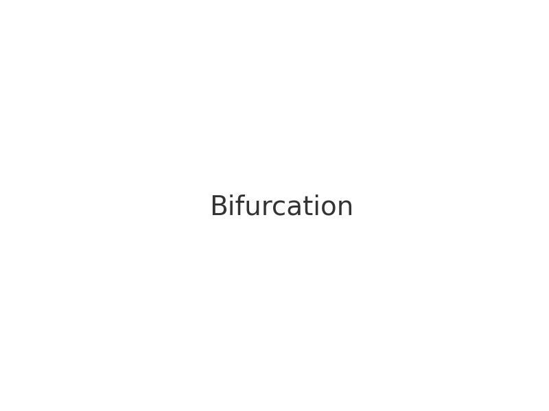

# Period Doubling and a Route to Chaos  

  
*Exploring the boundary between order and chaos in oscillatory systems.*

Welcome! This project explores how simple oscillators evolve into **chaotic motion**.  
Using both **GNU Octave** and **Unreal Engine (UDK)**, I recreated nonlinear systems — from mass-spring oscillators to fairground rides — to make the **period-doubling route to chaos** visible and intuitive.  

---

## Choose Your Path  

- 📘 [Full Report](./_posts/2025-09-26-period-doubling-writeup.md)  
  *A complete narrative with math, simulations, and figures.*  

- 🌍 [Popular Abstract](./_posts/2025-09-26-period-doubling-summary-popular.md)  
  *An accessible overview for general readers.*  

- 📑 [Research Abstract](./_posts/2025-09-26-period-doubling-summary-research.md)  
  *A concise, technical summary for a scientific audience.*  

---

## Repository  

📂 [View the full repository on GitHub](https://github.com/oospakooysa/period_doubling)  

---
